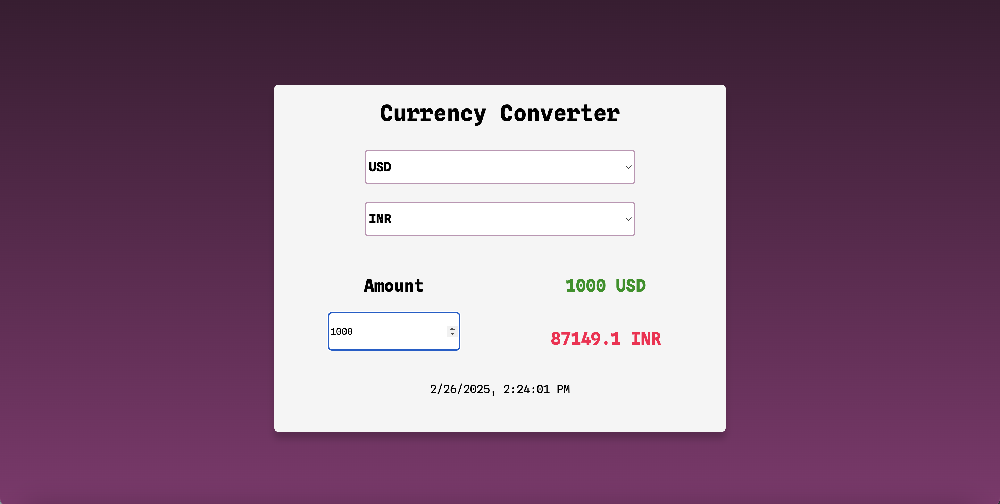

# Currency_Converter

A currency converter app where you have to select the "from" and "to" country, enter the amount, and get the converted currency.

### Tech Stack 
- Language: JavaScript, HTML, CSS
- Framework: React
- Exchange rate API

### Install Instructions
1. Clone this repository
2. ```cd currency_converter```
3. ```npm install```
4. ```npm run dev```

### Preview 

